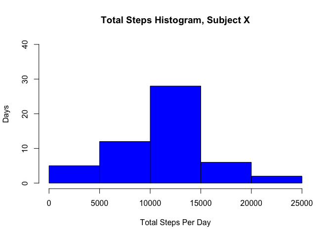

# Reproducible Research: Peer Assessment 1

The assignment instructions say to always use echo = TRUE. This is the default, so no need to set it or alter it. 

## Loading and preprocessing the data


```r
#Source data .zip file (repdata_data_activity.zip) downloaded from link 
#on Coursera website: https://d396qusza40orc.cloudfront.net
#Assumption: .zip has been unzipped and the .csv it contains is located in 
#the same directory as the .Rmd file.
df_orig <- read.csv("activity.csv")
```

## What is mean total number of steps taken per day?
First, make sure the dplyr package is loaded. 

```r
require(dplyr)
```

```
## Loading required package: dplyr
```

```
## 
## Attaching package: 'dplyr'
```

```
## The following objects are masked from 'package:stats':
## 
##     filter, lag
```

```
## The following objects are masked from 'package:base':
## 
##     intersect, setdiff, setequal, union
```
Now create a new dataframe with total number of steps per day.


```r
df_total_steps_per_day <- df_orig %>% group_by(date) %>% summarize(Total_Steps = sum(steps))
```

Create a histogram. Since I realized I do not understand the difference 
between a histogram and a barplot (doh!), I googled around and read this:
http://www.forbes.com/sites/naomirobbins/2012/01/04/a-histogram-is-not-a-bar-chart/#f6aefc328aff, which propelled me to create my histogram as follows.


```r
hist(df_total_steps_per_day$Total_Steps,xlab="Total Steps Per Day",ylab="Days", ylim = range(0,40),main="Total Steps Histogram, Subject X",col = "blue")
```

<!-- -->

Next, find and report the mean and median of the total number of steps per day. 
Note that we need to ignore NA records, of which there are 8 in the dataset. 
Mean:


```r
mean(df_total_steps_per_day$Total_Steps,na.rm = T)
```

```
## [1] 10766.19
```
And median:

```r
median(df_total_steps_per_day$Total_Steps,na.rm = T)
```

```
## [1] 10765
```

## What is the average daily activity pattern?

Plot the relationship of 5-minute intervals to average number of steps. Need to filter out the NAs. 


```r
df_avg_steps_per_interval <- subset(df_orig,!is.na(steps)) %>% group_by(interval) %>% summarize(Average_Steps = mean(steps))
with(df_avg_steps_per_interval,plot(interval,Average_Steps,type="l",xlab="5-minute interval", ylab="Steps",main="Average Steps Per Interval, Subject X"))
```

<!-- -->

Next, we want to identify which interval has the maximum Average_Steps value. 


```r
interval_with_max_steps <- filter(df_avg_steps_per_interval, Average_Steps == max(Average_Steps))
interval_with_max_steps$interval
```

```
## [1] 835
```

## Imputing missing values

Let's find the number of rows that contain missing values (NAs).


```r
df_with_na <- df_orig[!complete.cases(df_orig),]
str(df_with_na)
```

```
## 'data.frame':	2304 obs. of  3 variables:
##  $ steps   : int  NA NA NA NA NA NA NA NA NA NA ...
##  $ date    : Factor w/ 61 levels "2012-10-01","2012-10-02",..: 1 1 1 1 1 1 1 1 1 1 ...
##  $ interval: int  0 5 10 15 20 25 30 35 40 45 ...
```

OK, now update the original data.frame where the steps column is "NA" with the average for the corresponding interval value. This seems a bit dubious, but I'm doing what I'm told to do. 

Reminder that "df_orig" is the untouched R data.frame representation of activity.csv, and
"df_avg_steps_per_interval" is the average number of steps by interval (with NAs ignored).


```r
#Merge the two DFs on interval. This will give us a fourth column (Average_Steps).
df_orig_nas_updated <- merge(df_orig,df_avg_steps_per_interval,by="interval")
#Update the steps column when NA with the average for that interval.
df_orig_nas_updated$steps <- ifelse(is.na(df_orig_nas_updated$steps),df_orig_nas_updated$Average_Steps,df_orig_nas_updated$steps)
```
Present the same histogram and mean/median values as above, only this time after having updated all the NAs in the step column. 


```r
df_total_steps_per_day_no_nas <- df_orig_nas_updated %>% group_by(date) %>% summarize(Total_Steps = sum(steps))
```
The revised histogram:


```r
hist(df_total_steps_per_day_no_nas$Total_Steps,xlab="Total Steps Per Day",ylab="Days", ylim = range(0,40),main="Total Steps Histogram (updated NAs), Subject X",col = "blue")
```

<!-- -->

And the revised mean and median:


```r
mean(df_total_steps_per_day_no_nas$Total_Steps)
```

```
## [1] 10766.19
```

```r
median(df_total_steps_per_day_no_nas$Total_Steps)
```

```
## [1] 10766.19
```

After updating NAs in the steps column to the average of non-NAs for the same interval, the mean value is unchanged, however, the median increases slightly due to the addition of 8 days with an estimated 10000+ total step count. The revised histogram differs from the original in the 10000-15000 steps range only, for the same reason; whereas before, hist() simply ignored dates with NAs for sum(steps), those dates now all fall in the 10000-15000 steps range, increasing that block from 28 to 36 dates overall. 

## Are there differences in activity patterns between weekdays and weekends?

Add a field to the "df_orig" data.frame identifying whether a date falls on the "Weekend" (Saturday or Sunday); if not, if it is a "Weekday".


```r
df_orig$wkday <- as.factor(ifelse(weekdays(as.Date(df_orig$date)) %in% c('Saturday','Sunday'), "Weekend","Weekday"))
```

Create subsets of the data for Weekday vs Weekend. As in the previous interval by average steps plot, I am filtering out the NAs. 


```r
df_avg_steps_per_interval_wkday <- subset(df_orig,!is.na(steps) & df_orig$wkday == "Weekday") %>% group_by(interval) %>% summarize(Average_Steps = mean(steps))
df_avg_steps_per_interval_wkend <- subset(df_orig,!is.na(steps) & df_orig$wkday == "Weekend") %>% group_by(interval) %>% summarize(Average_Steps = mean(steps))
```

Plot the average number of steps per interval, Weekday vs Weekend. 


```r
#I am sure there are more elegant/fancy ways to do this, but... oh well. 
par(mfrow = c(2,1), mar = c(4,4,2,1))
with(df_avg_steps_per_interval_wkday,plot(interval,Average_Steps,type="l",xlab="WEEKDAY 5-minute interval", ylab="Steps",ylim = range(0,250),main="Average Steps Per Interval, Weekday vs Weekend, Subject X"))
with(df_avg_steps_per_interval_wkend,plot(interval,Average_Steps,type="l",xlab="WEEKEND 5-minute interval", ylab="Steps",ylim = range(0,250)))
```

<!-- -->
